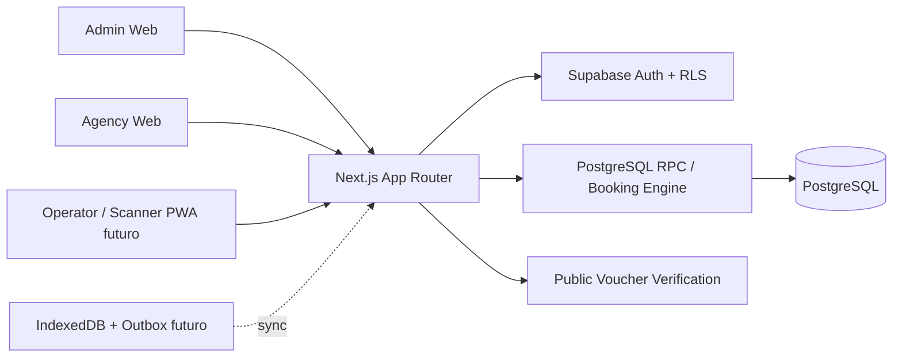

# Galápagos Digital Voucher Platform

<!-- PACKAGE_VERSION:0.1.0 -->
<!-- NEXT_VERSION:16.3.4 -->
<!-- REACT_VERSION:19.2.4 -->
<!-- PROJECT_STATUS:UNSTABLE -->

Plataforma B2B para gestionar disponibilidad, reservas y vouchers digitales de servicios turísticos en las Islas Galápagos. El objetivo del producto es conectar agencias de viaje, operadores turísticos y personal operativo con un flujo simple de inventario → reserva → voucher → validación/redención.

> **Estado actual:** `dev` ya incorporó **S0, R1 y R2**. La integración R1 mantiene **18/18 pruebas reales de Auth/RLS/RPC/PostgREST** y R2 añadió un **Critical E2E verde** que valida en Chromium el flujo login agency → búsqueda → reserva → voucher → inventario. `main` todavía NO se considera producción estable porque faltan redención operacional, pagos/conciliación, deploy/rollback probado y otras capacidades P1. El siguiente frente recomendado es **R3 — Voucher operacional / redención**. El estado autoritativo está en [BASELINE.md](./BASELINE.md).

## Lectura obligatoria antes de modificar código

1. [INDEX.md](./INDEX.md) — mapa completo del sistema documental.
2. [BASELINE.md](./BASELINE.md) — estado real, deuda y riesgos conocidos.
3. [AI_CONTEXT.md](./AI_CONTEXT.md) — reglas técnicas obligatorias.
4. [AGENT_PROTOCOL.md](./AGENT_PROTOCOL.md) — protocolo para agentes de IA.
5. [Roadmap](./docs/roadmap/ROADMAP.md) — orden de rescate y evolución.

Una persona nueva debe poder completar la guía [Onboarding en 15 minutos](./docs/guides/ONBOARDING_15_MIN.md) antes de realizar cambios.

## Arquitectura de alto nivel



Detalles: [docs/architecture/system-overview.md](./docs/architecture/system-overview.md).

## Stack

- Next.js 16.3.4, App Router y Turbopack.
- React 19.2.4 + TypeScript 5 en modo `strict`.
- Tailwind CSS 4.
- Supabase SSR / Supabase JS.
- PostgreSQL + RLS + funciones RPC mediante migraciones Supabase.
- GitHub Actions para gates de documentación, producción, integración Supabase y E2E crítico.
- Playwright fijado en CI para el gate de navegador, sin incorporarlo todavía al lockfile principal.

## Rutas actuales

| Área | Ruta | Estado |
|---|---|---|
| Login | `/` | Funcional; redirect y `next` protegidos por rol |
| Admin | `/admin` | Parcial; altas reales de agencias/tours/embarcaciones |
| Agencias | `/agency` | Búsqueda server-side, contexto de agencia, comisión y reserva reales |
| Reservas agencia | `/agency/reservations` | Funcional parcial |
| Operador | `/operator` | Parcial; ownership de flota validado en runtime |
| Cupos | `/operator/availability` | Funcional parcial; mutación por RPC con ownership |
| Redención operador | `/operator/redeem` | Verificación y redención online mediante RPC atómico |
| Voucher público | `/verify/[token]` | Validación online, QR y estado de redención |

## Inicio rápido

```bash
npm ci
cp .env.example .env.local
# Configura NEXT_PUBLIC_SUPABASE_URL y NEXT_PUBLIC_SUPABASE_ANON_KEY
supabase start
supabase db reset
npm run dev
```

El lockfile está sincronizado y `npm ci` es la instalación autoritativa. No usar `npm install` para ocultar drift entre `package.json` y `package-lock.json`.

## Comandos de calidad

```bash
npm run lint
npm run typecheck
npm test
npm run docs:validate
npm run docs:health
npm run changelog:validate
npm run build
```

Para pruebas RLS/RPC reales, con un Supabase local levantado y las credenciales locales exportadas:

```bash
npm run test:integration
```

El workflow `Supabase Integration` automatiza el stack efímero, `db reset`, usuarios/fixtures y **18 pruebas de integración** en PRs relevantes contra `dev`/`main`; no usa secretos del proyecto remoto.

El workflow `Critical E2E` levanta un Supabase local mínimo y ejecuta Chromium contra la aplicación real. El flujo integrado verifica login de agencia, búsqueda, reserva de dos pasajeros, cálculo de comisión, voucher público, login de operador, redención y bloqueo del segundo uso. La guía completa de ejecución local está en [docs/guides/TESTING.md](./docs/guides/TESTING.md). R3 añade integración PostgreSQL para redención, anti doble uso, concurrencia y autorización.

Los workflows de PR usan cancelación de ejecuciones obsoletas donde aplica para evitar consumir minutos en revisiones reemplazadas por un commit más reciente. CI debe ser verde antes de mergear a `dev`. `main` requiere además revisión y gate de producción.

## Flujo Git

```text
feature/* o fix/*
      ↓ PR + CI + review
dev
      ↓ PR de fase + revisión explícita
main
```

Ver [docs/guides/GIT_WORKFLOW.md](./docs/guides/GIT_WORKFLOW.md).

## Principios no negociables

- No bypass de RLS para resolver problemas de permisos.
- No lógica crítica de inventario en el cliente.
- No cambios directos a `main` ni a `dev`; trabajar mediante rama y PR.
- No mocks presentados como funcionalidad productiva.
- No merge con build rojo.
- No cambio de contratos, roles, tablas o comportamiento público sin documentación asociada.
- Reservas productivas deben pasar por el motor RPC transaccional, no por inserts directos.
- Cambios de permisos requieren pruebas positivas y negativas contra Supabase real.
- No automatización productiva de WhatsApp Web; usar APIs autorizadas.

## Próximo frente

**R3 — Voucher operacional / redención** está implementado en esta feature branch a nivel de migración, integración, E2E y UI mínima: QR, redención autoritativa, anti doble uso, auditoría y pruebas negativas/positivas. Falta ejecutar CI contra Supabase/Docker antes de abrir PR.

## Estado de producción

Los criterios completos están en [PRODUCTION_READINESS.md](./docs/guides/PRODUCTION_READINESS.md). S0, R1 y R2 están integrados en `dev`, pero hasta que existan redención/pagos prioritarios y despliegue/rollback probado, este repositorio debe tratarse como **producto en estabilización**.
